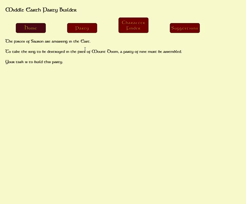
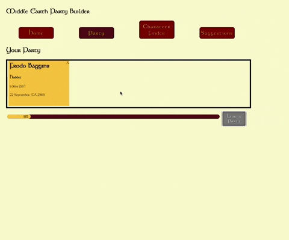
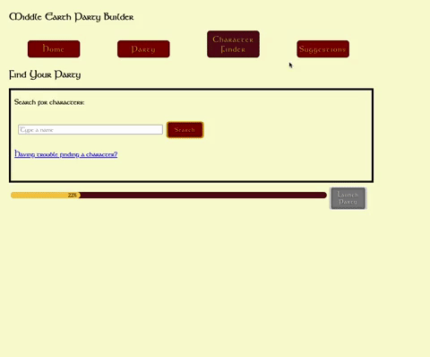
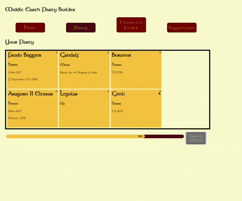
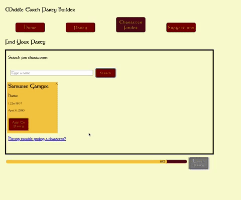

# Middle Earth Party Builder

The Middle Earth Party Builder is a single page React Application which works with [The One Api](https://the-one-api.dev/) to allow users to build their own party of Tolkein characters.

It was partly designed to fulfil a set of passing criteria for the phase 2 project of Flatiron's Software Engineering Course.

## User Experience

Clien-side routes can be navigated via the nav bar:

In the character finder, users can search for Tolkein characters and add them to their party:

In the suggestions route, users can click names to copy them to their clickboard before searching:

Users can also delete characters in their party:

Once the party is full, users can 'launch' their party and be taken to a custom, final screen:

## Project Requirements of Middle-Earth Party Builder

1) You must make a single page application (only one `index.html` file) using `create-react-app`.

    This is a single page application and was created using create-react-app

2) Your app should use at least 5 components in a way that keeps your code well organized.

    This app uses a total of 15 components. The majority of event handling and state is held in the top-level `App` component, the exception being the `LaunchScreen` component holding its own.

3) There should be at least 3 client-side routes using React Router. 

    There are a total of 5 client-side routes available to the user, all done using React Router v5.

4) Use a `json-server` to create a RESTful API for your backend and make both a GET and a POST request to the json server. Use a form to make your post request, specifically a controlled form/component. Additionally, you may choose to incorporate data from an external API but it is not required.

    A `json-server` is used to track the users' party. The `partyCards` state recieve their data from GET requests to this server. The `FinderForm` is a controlled form which feeds its data first through an external API [The One Api](https://the-one-api.dev/)  before allowing the user to POST it to the server. Additionaly, as mentioned, users can send DELETE requests.

5) Add some styling

    This app was styled with [styled-components](https://styled-components.com/).

## Notes

- Users cannot add the same party members twice or add more than nine party members. Frodo Baggins cannot be removed from the party.

- Notifications in this app, were made through the use of [Toastify](https://aleab.github.io/toastify/)

- The styling of the buttons was taken from the codepen [Fantasy Game Buttons by Manoel Gomes Neto](https://codepen.io/manelsworld/pen/YvPVaw)

- The custom progress bar was heavily influenced by [this blog](https://dev.to/ramonak/react-how-to-create-a-custom-progress-bar-component-in-5-minutes-2lcl) by Katsiaryna Lupachova

- This site was deployed via Netlify and Heroku at https://middle-earth-party-builder.netlify.app/

- The font used in this site is [Kelt](https://tolkiengateway.net/wiki/Fonts) © Bay Animation Inc., 1994
